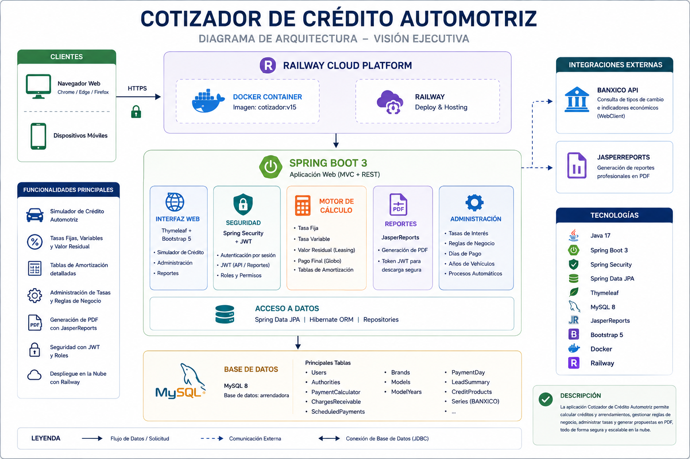

# 🚗 Automotive Financing Platform

### Enterprise Web Application for Automotive Financing & Leasing

A cloud-deployed web application developed with Spring Boot 3 that automates automotive financing quotations, leasing calculations, business rule management, and secure PDF proposal generation.

---

### 🌐 Live Demo

> **Demo Environment**
>
> This application is deployed on Railway for demonstration purposes.
> Some administrative features require authentication.

> https://cotizador-production-0680.up.railway.app/creditos/automotriz/simulador

---

---

## 📌 Business Problem

Automotive financing requires accurate and flexible calculations that can adapt to different financial products, vehicle conditions, interest rates, and business rules.

Traditional quotation processes can involve manual calculations and multiple sources of information, making the process time-consuming and increasing the risk of inconsistencies.

The **Automotive Financing Platform** was designed to provide a centralized solution for generating automotive financing and leasing quotations while allowing business users to manage the rules and parameters that control the calculation process.

### Business objectives

- Automate automotive financing calculations.
- Support different financing and leasing scenarios.
- Generate detailed amortization schedules.
- Centralize interest rate management.
- Configure business rules without modifying application code.
- Generate professional PDF quotation documents.
- Provide secure access to administrative functionality.
- Maintain a clear separation between business logic, persistence, security, and presentation.

## 💡 Solution Overview

The **Automotive Financing Platform** provides a centralized web application for simulating and managing automotive financing products.

The platform combines financial calculation services, business rules, administration capabilities, security, and document generation into a single application.

### Core Capabilities

#### 🚗 Credit & Leasing Simulation

The platform supports different automotive financing scenarios, including:

- Fixed-rate financing.
- Variable-rate financing.
- Leasing with residual value.
- Down payment configuration.
- Financing term selection.
- Vehicle and model selection.
- Payment calculation.
- Detailed amortization schedules.

#### 📊 Financial Calculation

The calculation engine processes the quotation parameters and generates the corresponding payment schedule, including:

- Principal balance.
- Interest.
- Capital repayment.
- Charges.
- Payment dates.
- Remaining balance.

#### ⚙️ Business Rules Management

The platform provides configurable business rules that allow administrators to control parameters used during the automotive financing process.

##### Payment Due Day

Administrators can define the payment due day used to generate the amortization schedule.

For example, if the configured payment day is **15**, the generated amortization schedule will use the 15th day of each corresponding payment period as the due date.

This allows the platform to support different business policies, such as payment schedules with due dates on the 1st, 15th, or another configured day of the month.

##### Used Vehicle Eligibility

The platform allows administrators to configure the maximum vehicle age accepted for automotive financing.

This rule is particularly relevant for used vehicles, where financing institutions may establish an age limit as part of their credit policies.

For example, if the configured maximum vehicle age is **8 years**, vehicles exceeding the applicable age policy are not considered eligible for financing.

##### Automatic Processes

The platform provides a configurable list of processes that can be executed by the system.

Currently, the implemented process is related to **Residual Value** for pure leasing.

In a pure leasing scenario, the residual value represents the amount that remains outstanding at the end of the financing term.

For example, for a vehicle valued at **$1,000,000** with a residual value of **$400,000**, the amortization schedule is structured so that the final outstanding balance is $400,000.

At the end of the lease, the customer has the right to purchase the vehicle for the configured residual value.

#### 📄 PDF Quotation Generation

The platform generates professional PDF documents containing the quotation information and payment schedule using **JasperReports**.

Report access is protected through a dedicated JWT-based mechanism.

#### 🔐 Security & Administration

Administrative functionality is protected using **Spring Security**, with authentication and role-based authorization.

The application also exposes REST endpoints secured through JWT authentication for specific services.

#### 🌐 External Integration

The application integrates with **BANXICO** services through Spring WebClient to retrieve financial information used by the platform.

#### 📈 Variable Rate Calculation

For variable-rate financing, the platform retrieves the applicable reference rate from **BANXICO** and combines it with a configurable financial margin.

The calculation follows the business rule:

**Base Rate = BANXICO Reference Rate + Financial Margin**

The resulting base rate is then used by the calculation engine to generate the corresponding amortization schedule.

The financial margin is configurable through the administration module, allowing the business user to adjust the spread applied to the reference rate without modifying the application source code.

## 🏗️ Architecture

The **Automotive Financing Platform** follows a layered architecture designed to separate presentation, business logic, security, and data persistence responsibilities.

The application is built as a **Spring Boot 3 monolithic web application**, using Thymeleaf for the web interface and exposing selected REST endpoints for API-based operations.

### Architecture Overview

The main components of the solution are:

- **Presentation Layer** — Thymeleaf, HTML, CSS and Bootstrap provide the web interface.
- **Controller Layer** — Spring MVC controllers handle HTTP requests and coordinate application flows.
- **Business Layer** — Facades and services encapsulate financial calculations, business rules, leads, rates, and report generation.
- **Persistence Layer** — Spring Data JPA and Hibernate provide ORM capabilities for interacting with MySQL.
- **Security Layer** — Spring Security provides authentication and authorization, while JWT is used for selected REST services and protected report operations.
- **Reporting** — JasperReports generates PDF quotation documents.
- **External Integration** — Spring WebClient is used to retrieve reference rate information from BANXICO.
- **Database** — MySQL stores quotations, vehicles, rates, business rules, users, and related application data.

## 🛠️ Technology Stack

### Backend

| Technology | Purpose |
|---|---|
| **Java 17** | Application development language |
| **Spring Boot 3.3** | Application framework |
| **Spring MVC** | Web and REST request handling |
| **Spring Data JPA** | Data access and persistence |
| **Hibernate** | ORM and entity management |
| **Maven** | Dependency management and build automation |

### Frontend

| Technology | Purpose |
|---|---|
| **Thymeleaf** | Server-side HTML rendering |
| **Bootstrap 5** | Responsive user interface |
| **HTML5 / CSS3** | Web presentation |

### Database

| Technology | Purpose |
|---|---|
| **MySQL 8** | Relational database |
| **JPA / Hibernate** | Object-relational mapping |

### Security

| Technology | Purpose |
|---|---|
| **Spring Security** | Authentication and authorization |
| **JWT** | Stateless authentication for selected REST services and protected report operations |

### Reporting

| Technology | Purpose |
|---|---|
| **JasperReports** | PDF quotation generation |

### External Integration

| Technology | Purpose |
|---|---|
| **Spring WebClient** | HTTP client for external API integration |
| **BANXICO API** | Reference rate information used in variable-rate calculations |

### DevOps & Deployment

| Technology | Purpose |
|---|---|
| **Docker** | Application containerization |
| **Docker Compose** | Local multi-container development environment |
| **Docker Hub** | Container image registry |
| **Railway** | Cloud deployment and hosting |
| **Git** | Version control |

### API Documentation

Selected REST endpoints are documented using **OpenAPI / Swagger**, providing an interactive interface for exploring and testing the application's APIs.
