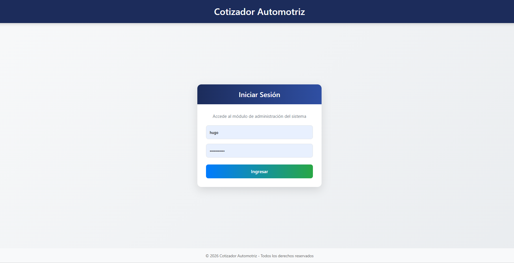
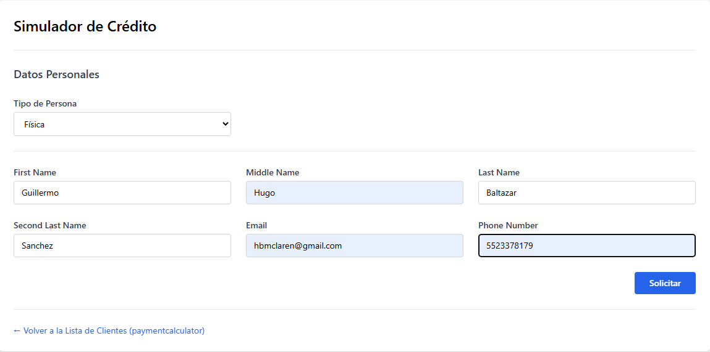
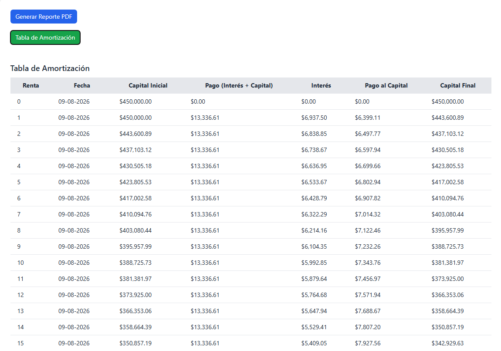
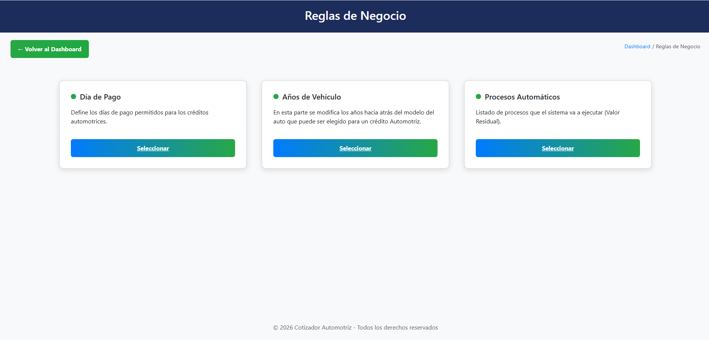
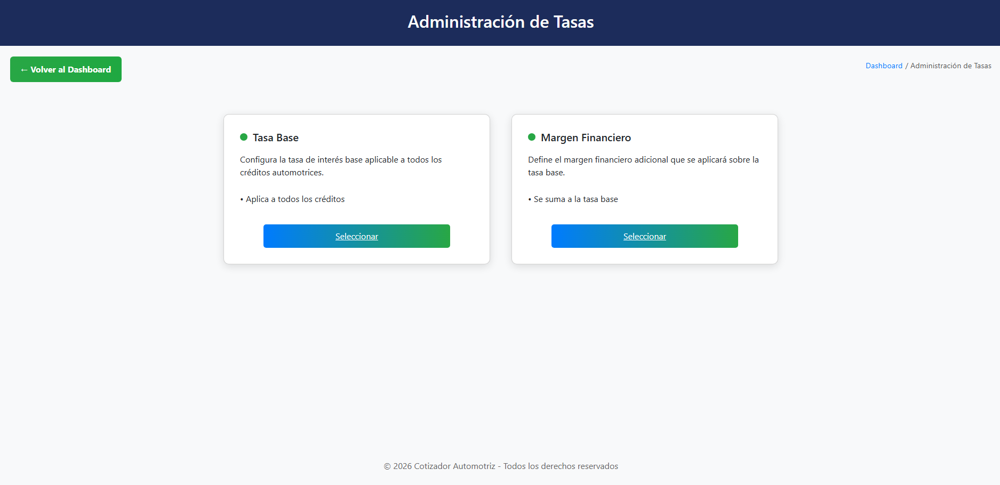
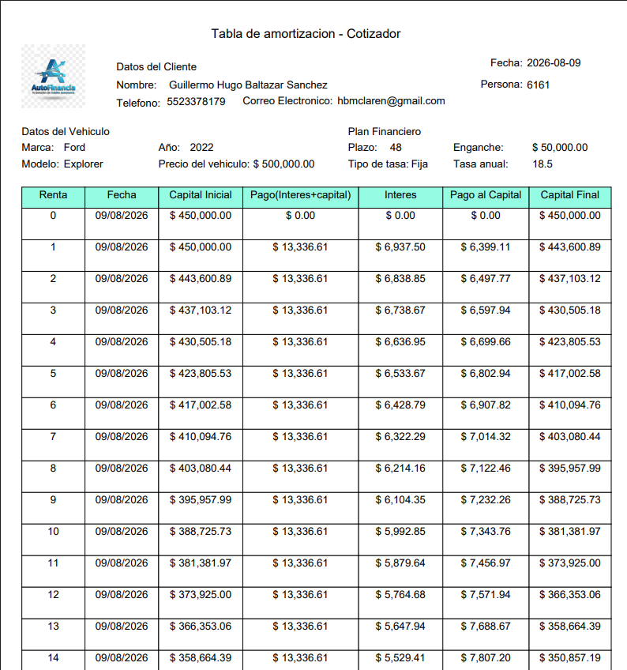

# 🚗 Automotive Financing Platform

### Enterprise Web Application for Automotive Financing & Leasing

A cloud-deployed web application developed with Spring Boot 3 that automates automotive financing quotations, leasing calculations, business rule management, and secure PDF proposal generation.

---

### 🌐 Live Demo

> **Demo Environment**
>
> This application is deployed on Railway for demonstration purposes.
> Some administrative features require authentication.

> https://cotizador-production-0680.up.railway.app/creditos/automotriz/simulador

---


---


## 📌 Business Problem

Automotive financing requires accurate and flexible calculations that can adapt to different financial products, vehicle conditions, interest rates, and business rules.

Traditional quotation processes can involve manual calculations and multiple sources of information, making the process time-consuming and increasing the risk of inconsistencies.

The **Automotive Financing Platform** was designed to provide a centralized solution for generating automotive financing and leasing quotations while allowing business users to manage the rules and parameters that control the calculation process.

### Business objectives

- Automate automotive financing calculations.
- Support different financing and leasing scenarios.
- Generate detailed amortization schedules.
- Centralize interest rate management.
- Configure business rules without modifying application code.
- Generate professional PDF quotation documents.
- Provide secure access to administrative functionality.
- Maintain a clear separation between business logic, persistence, security, and presentation.

## 💡 Solution Overview

The **Automotive Financing Platform** provides a centralized web application for simulating and managing automotive financing products.

The platform combines financial calculation services, business rules, administration capabilities, security, and document generation into a single application.

### Core Capabilities

#### 🚗 Credit & Leasing Simulation

The platform supports different automotive financing scenarios, including:

- Fixed-rate financing.
- Variable-rate financing.
- Leasing with residual value.
- Down payment configuration.
- Financing term selection.
- Vehicle and model selection.
- Payment calculation.
- Detailed amortization schedules.

#### 📊 Financial Calculation

The calculation engine processes the quotation parameters and generates the corresponding payment schedule, including:

- Principal balance.
- Interest.
- Capital repayment.
- Charges.
- Payment dates.
- Remaining balance.

#### ⚙️ Business Rules Management

The platform provides configurable business rules that allow administrators to control parameters used during the automotive financing process.

##### Payment Due Day

Administrators can define the payment due day used to generate the amortization schedule.

For example, if the configured payment day is **15**, the generated amortization schedule will use the 15th day of each corresponding payment period as the due date.

This allows the platform to support different business policies, such as payment schedules with due dates on the 1st, 15th, or another configured day of the month.

##### Used Vehicle Eligibility

The platform allows administrators to configure the maximum vehicle age accepted for automotive financing.

This rule is particularly relevant for used vehicles, where financing institutions may establish an age limit as part of their credit policies.

For example, if the configured maximum vehicle age is **8 years**, vehicles exceeding the applicable age policy are not considered eligible for financing.

##### Automatic Processes

The platform provides a configurable list of processes that can be executed by the system.

Currently, the implemented process is related to **Residual Value** for pure leasing.

In a pure leasing scenario, the residual value represents the amount that remains outstanding at the end of the financing term.

For example, for a vehicle valued at **$1,000,000** with a residual value of **$400,000**, the amortization schedule is structured so that the final outstanding balance is $400,000.

At the end of the lease, the customer has the right to purchase the vehicle for the configured residual value.

#### 📄 PDF Quotation Generation

The platform generates professional PDF documents containing the quotation information and payment schedule using **JasperReports**.

Report access is protected through a dedicated JWT-based mechanism.

#### 🔐 Security & Administration

Administrative functionality is protected using **Spring Security**, with authentication and role-based authorization.

The application also exposes REST endpoints secured through JWT authentication for specific services.

#### 🌐 External Integration

The application integrates with **BANXICO** services through Spring WebClient to retrieve financial information used by the platform.

#### 📈 Variable Rate Calculation

For variable-rate financing, the platform retrieves the applicable reference rate from **BANXICO** and combines it with a configurable financial margin.

The calculation follows the business rule:

**Base Rate = BANXICO Reference Rate + Financial Margin**

The resulting base rate is then used by the calculation engine to generate the corresponding amortization schedule.

The financial margin is configurable through the administration module, allowing the business user to adjust the spread applied to the reference rate without modifying the application source code.

## 🏗️ Architecture

The **Automotive Financing Platform** follows a layered architecture designed to separate presentation, business logic, security, and data persistence responsibilities.

The application is built as a **Spring Boot 3 monolithic web application**, using Thymeleaf for the web interface and exposing selected REST endpoints for API-based operations.

### Architecture Overview


The main components of the solution are:

- **Presentation Layer** — Thymeleaf, HTML, CSS and Bootstrap provide the web interface.
- **Controller Layer** — Spring MVC controllers handle HTTP requests and coordinate application flows.
- **Business Layer** — Facades and services encapsulate financial calculations, business rules, leads, rates, and report generation.
- **Persistence Layer** — Spring Data JPA and Hibernate provide ORM capabilities for interacting with MySQL.
- **Security Layer** — Spring Security provides authentication and authorization, while JWT is used for selected REST services and protected report operations.
- **Reporting** — JasperReports generates PDF quotation documents.
- **External Integration** — Spring WebClient is used to retrieve reference rate information from BANXICO.
- **Database** — MySQL stores quotations, vehicles, rates, business rules, users, and related application data.

## 🛠️ Technology Stack

### Backend

| Technology | Purpose |
|---|---|
| **Java 17** | Application development language |
| **Spring Boot 3.3** | Application framework |
| **Spring MVC** | Web and REST request handling |
| **Spring Data JPA** | Data access and persistence |
| **Hibernate** | ORM and entity management |
| **Maven** | Dependency management and build automation |

### Frontend

| Technology | Purpose |
|---|---|
| **Thymeleaf** | Server-side HTML rendering |
| **Bootstrap 5** | Responsive user interface |
| **HTML5 / CSS3** | Web presentation |

### Database

| Technology | Purpose |
|---|---|
| **MySQL 8** | Relational database |
| **JPA / Hibernate** | Object-relational mapping |

### Security

| Technology | Purpose |
|---|---|
| **Spring Security** | Authentication and authorization |
| **JWT** | Stateless authentication for selected REST services and protected report operations |

### Reporting

| Technology | Purpose |
|---|---|
| **JasperReports** | PDF quotation generation |

### External Integration

| Technology | Purpose |
|---|---|
| **Spring WebClient** | HTTP client for external API integration |
| **BANXICO API** | Reference rate information used in variable-rate calculations |

### DevOps & Deployment

| Technology | Purpose |
|---|---|
| **Docker** | Application containerization |
| **Docker Compose** | Local multi-container development environment |
| **Docker Hub** | Container image registry |
| **Railway** | Cloud deployment and hosting |
| **Git** | Version control |

### API Documentation

Selected REST endpoints are documented using **OpenAPI / Swagger**, providing an interactive interface for exploring and testing the application's APIs.

## ✨ Key Features

### 🚗 Automotive Financing Simulation

- Automotive credit quotation generation.
- New and used vehicle financing.
- Vehicle brand, model, and year selection.
- Configurable financing terms.
- Down payment configuration.
- Fixed-rate financing.
- Variable-rate financing.
- Pure leasing with residual value.
- Detailed amortization schedules.

### 📊 Financial Calculation Engine

- Automated payment calculation.
- Interest and principal breakdown.
- Payment schedule generation.
- Configurable payment due dates.
- Residual balance calculation for leasing scenarios.
- Support for configurable financial margins.

### ⚙️ Business Rules Administration

Administrators can configure key parameters that control the quotation process:

- Payment due day.
- Maximum vehicle age for financing.
- Financial margin for variable-rate products.
- Automatic processes.
- Residual value configuration.

### 📈 Variable Rate Integration

- Reference rate retrieval through BANXICO integration.
- Configurable financial margin.
- Dynamic base-rate calculation.
- Integration of external financial data into the quotation engine.

### 📄 PDF Reports

- Professional quotation document generation.
- Amortization schedule included in generated reports.
- JasperReports integration.
- Protected report access using JWT-based tokens.

### 🔐 Authentication & Authorization

- Spring Security integration.
- Secure administrative area.
- Role-based authorization.
- Session-based authentication for web administration.
- JWT authentication for selected REST services.
- JWT-protected report access.

### 🌐 REST API

- REST endpoints for selected application services.
- OpenAPI / Swagger documentation.
- Interactive API exploration and testing.

### 🐳 Containerized Deployment

- Dockerized Spring Boot application.
- Docker Compose environment for local development.
- MySQL container for local persistence.
- Docker Hub image management.
- Cloud deployment through Railway.

## 📸 Screenshots

### 🔐 Authentication

Secure access to the administration area using Spring Security.



---

### 🚗 Automotive Financing Simulation

The main quotation interface allows users to configure the vehicle, financing parameters, and product conditions to generate an automotive financing proposal.



---

### 📊 Amortization Schedule

The platform generates a detailed amortization schedule based on the selected financing conditions, including payment dates, principal, interest, charges, and outstanding balance.



---

### ⚙️ Business Rules Administration

Authorized administrators can configure the parameters that control the quotation process, including payment due dates, vehicle eligibility rules, and automatic processes.



---

### 📈 Interest Rate Management

The administration module allows authorized users to manage the interest-rate parameters used by the financial calculation engine, including the configurable financial margin used in variable-rate calculations.



---

### 📄 PDF Quotation

The generated quotation can be exported as a professional PDF document containing the financing information and amortization schedule.



## 🔒 Security Architecture

The platform implements multiple security mechanisms depending on the type of resource being accessed.

### Web Application Security

The administrative web application uses **Spring Security** for authentication and authorization.

The administration area is protected through role-based access control, ensuring that only authorized users can access configuration and management functionality.

```text
User
  │
  ▼
Spring Security
  │
  ├── Authentication
  │
  └── Role-based Authorization
          │
          ▼
    Administration
```

### JWT Authentication

Selected REST services use **JWT-based authentication** to support stateless API access.

```text
Client
  │
  │ Login credentials
  ▼
Authentication Endpoint
  │
  ▼
JWT Token
  │
  ▼
Protected REST Endpoint
  │
  ▼
JWT Validation
  │
  ▼
Authorized Request
```

### Protected PDF Reports

PDF report generation uses a dedicated JWT-based token mechanism.

The application generates a short-lived token associated with the requested quotation, which is then used to securely access the generated report.

```text
Quotation Request
       │
       ▼
Generate Report Token
       │
       ▼
Short-lived JWT
       │
       ▼
Protected PDF Endpoint
       │
       ▼
JasperReports
       │
       ▼
PDF Document
```

### Security Principles

The security implementation follows these principles:

- Role-based authorization for administrative functionality.
- Stateless JWT authentication for selected REST services.
- Short-lived tokens for protected report access.
- Secrets provided through environment variables.
- Separation between authentication, authorization, and business logic.

## 🚀 Deployment

The application is fully containerized using Docker and deployed to the cloud using Railway.

The deployment architecture consists of:

- Spring Boot application packaged as a Docker image.
- Docker Hub as the container registry.
- Railway as the cloud hosting platform.
- MySQL as the relational database.
- Environment variables for secure configuration management.

### Deployment Workflow

```text
Developer
     │
     ▼
 Maven Build
     │
     ▼
 Docker Image
     │
     ▼
 Docker Hub
     │
     ▼
 Railway Deployment
     │
     ▼
 Production Environment
```

### Environment Variables

The application uses environment variables for sensitive configuration.

| Variable | Description |
|-----------|-------------|
| DB_URL | Database connection URL |
| DB_USER | Database username |
| DB_PASSWORD | Database password |
| JWT_SECRET | JWT signing secret |
| REPORT_JWT_SECRET | Report JWT signing secret |

> Sensitive values are intentionally omitted from this repository.

### Deployment Highlights

- ✅ Dockerized Spring Boot application
- ✅ Cloud deployment on Railway
- ✅ Environment-based configuration
- ✅ Container image versioning
- ✅ Separate development and production environments

### Live Demo

The latest deployed version is available at:

https://cotizador-production-0680.up.railway.app/creditos/automotriz/simulador

### Containerization

The application runs inside a Docker container, ensuring a consistent execution environment across local development and cloud deployment.

Containerization also simplifies versioning, portability, and deployment automation.

## 🌐 API Documentation

The **Automotive Financing Platform** exposes REST endpoints for selected application services.

The API is documented using **OpenAPI / Swagger**, providing an interactive interface for exploring endpoints, reviewing request and response schemas, and testing API operations.

### API Modules

| Module | Description |
|---|---|
| **Authentication** | User authentication and JWT token generation |
| **Rates** | Interest-rate management and retrieval |
| **Automotive Financing** | Services related to automotive credit quotations |
| **Vehicles** | Vehicle brands, models, and related information |
| **Leads** | Lead and quotation-related operations |
| **Reports** | Secure report-token generation and PDF report access |

### API Capabilities

- RESTful HTTP endpoints.
- OpenAPI-based documentation.
- Interactive Swagger UI.
- Request parameter documentation.
- Response schema documentation.
- JWT authentication for selected protected endpoints.
- HTTP status and error response documentation.

### Swagger UI

When running the application locally, the API documentation is available through Swagger UI:

```text
http://localhost:8080/swagger-ui/index.html
```

The Swagger interface allows developers to inspect and test the available API operations directly from the browser.

> **Note:** API documentation and endpoint availability may vary between development and production environments.

## 🐳 Deployment & Infrastructure

The application is containerized using **Docker** and deployed to the cloud through **Railway**.

### Deployment Architecture

```text
Developer Workstation
        │
        │ Maven Build
        ▼
   Spring Boot JAR
        │
        │ Docker Build
        ▼
   Docker Image
        │
        │ Push
        ▼
     Docker Hub
        │
        │ Deploy
        ▼
      Railway
        │
        ├───────────────┐
        ▼               ▼
 Spring Boot       MySQL Database
 Application
        │
        ▼
     BANXICO
   External API
```

### Containerization

The application is packaged as a Docker image containing the Spring Boot application and its runtime environment.

The containerized approach provides:

- Consistent application runtime.
- Reproducible deployments.
- Environment-based configuration.
- Separation between application and infrastructure.
- Simplified deployment across environments.

### Local Development Environment

Docker Compose is used to run the application and MySQL database locally.

```text
Docker Compose
      │
      ├── Spring Boot Application
      │        │
      │        ▼
      │     MySQL
      │
      └── Network
```

Database credentials and application configuration are provided through environment variables rather than hard-coded application properties.

### Cloud Deployment

The application is deployed to **Railway** using the Docker container image.

The deployment environment provides the required runtime configuration through environment variables, including:

- Database connection URL.
- Database username and password.
- JWT signing secret.
- Report JWT signing secret.
- Application port.

### Container Image Management

Docker images are built locally and published to **Docker Hub** before being deployed to the cloud environment.

This provides a clear separation between:

```text
Source Code
     ↓
Build
     ↓
Docker Image
     ↓
Container Registry
     ↓
Cloud Deployment
```

### Environment Configuration

Environment-specific configuration is externalized from the application source code.

Sensitive values such as database credentials and JWT secrets are injected at runtime through environment variables.

This prevents credentials and cryptographic secrets from being committed to the source repository.

## 🧩 Project Structure

The application follows a layered structure that separates presentation, business logic, persistence, security, and integration responsibilities.

```text

src/
└── main/
    ├── java/
    │   └── com/
    │       └── cotizador/
    │            ├─ configuration
    │            │  └─WebClientConfig                         [class]  
    │            ├─ controller
    │            │  └─api
    │            │   │    └─ RateApiController                [class]
    │            │   │    └─ RateViewController               [class]
    │            │   └─report
    │            │   │   └─ ReportController                  [class]
    │            │   ├─ AdminController                       [class]
    │            │   ├─ IndividualController                  [class]
    │            │   ├─ LoginController                       [class]
    │            │   ├─ PaymentCalculatorController           [class]
    │            │
    │            │
    │            ├── dao/
    │            │   ├── BrandsDAO.java                       [interface]
    │            │   ├── BrandsDAOImp.java                    [class]
    │            │   ├── ChargesDAO.java                      [interface]
    │            │   ├── ChargesDAOImp.java                   [class]
    │            │   ├── ChargesReceivableDAO.java            [interface]
    │            │   ├── ChargesReceivableDAOImp.java         [class]
    │            │   ├── HolidayRepository.java               [interface]
    │            │   ├── IndividualDAO.java                   [interface]
    │            │   ├── IndividualDAOImp.java                [class]
    │            │   ├── LegalEntitiesDAO.java                [interface]
    │            │   ├── LegalEntitiesDAOImp.java             [class]
    │            │   ├── ModelsDAO.java                       [interface]
    │            │   ├── ModelsDAOImp.java                    [class]
    │            │   ├── PaymentcalculatorDAO.java            [interface]
    │            │   ├── PaymentcalculatorDAOImp.java         [class]
    │            │   ├── PaymentDayDAO.java                   [interface]
    │            │   ├── PaymentDayImp.java                   [class]
    │            │   ├── ProcessDAO.java                      [interface]
    │            │   ├── ProcessDAOImp.java                   [class]
    │            │   ├── RateDAO.java                         [interface]
    │            │   ├── RateDAOImp.java                      [class]
    │            │   ├── ResidualValueDAO.java                [interface]
    │            │   ├── ResidualValueDAOImp.java             [class]
    │            │   ├── RoleDAO.java                         [interface]
    │            │   ├── RoleDAOImp.java                      [class]
    │            │   ├── ScheduledPaymentDAO.java             [interface]
    │            │   ├── ScheduledPaymentDAOJpaImp.java       [class]
    │            │   ├── SpreadDAO.java                       [interface]
    │            │   ├── SpreadDAOImp.java                    [class]
    │            │   ├── TaxesDAO.java                        [interface]
    │            │   ├── TaxesDAOImp.java                     [class]
    │            │   ├── UsersDAO.java                        [interface]
    │            │   ├── UsersDAOImp.java                     [class]
    │            │   ├── VehicleYearsDAO.java                 [interface]
    │            │   └── VehicleYearsDAO.java                 [class]
    │            │
    │            ├── entity/
    │            │   ├── BrandsDAOImp.java                    [class]      
    │            │   ├── ChargesDAOImp.java                   [class]
    │            │   ├── ChargesReceivableDAOImp.java         [class]
    │            │   ├── IndividualDAOImp.java                [class]
    │            │   ├── LegalEntitiesDAOImp.java             [class]
    │            │   ├── ModelsDAOImp.java                    [class]
    │            │   ├── PaymentcalculatorDAOImp.java         [class]
    │            │   ├── PaymentDayImp.java                   [class]
    │            │   ├── ProcessDAOImp.java                   [class]
    │            │   ├── RateDAOImp.java                      [class]
    │            │   ├── ResidualValueDAOImp.java             [class]
    │            │   ├── RoleDAOImp.java                      [class]
    │            │   ├── ScheduledPaymentDAOJpaImp.java       [class]
    │            │   ├── SpreadDAOImp.java                    [class]
    │            │   ├── TaxesDAOImp.java                     [class]
    │            │   ├── UsersDAOImp.java                     [class]
    │            │   └── VehicleYearsDAO.java                 [class]
    │            ├── exception/
    │            │   ├── CustomException.java                 [class]      
    │            │   ├── PaymentCalculatorErrorResponse.java  [class]
    │            │   ├── PaymentCalculatorNotFoundException.java  [class]
    │            │   └── PaymentCalculatorRestExceptionHandler.java [class]
    │            ├── integration
    │            │   │    └─banxico
    │            │   │      └─ BanxicoTiieeClient                  [class]
    │            │   │
    │            ├── security/
    │            │   │    └─jwt
    │            │   │       └─ SecurityConfig                     [class]
    │            │── service/
    │            │    ├── calculator/
    │            │    │      ├── FrenchInterestService.java        [class]      
    │            │    │      ├── InterestCalculator.java           [interface]
    │            │    │      └── PaymentCalculatorFactory.java     [class]
    │            │    ├── charges/
    │            │    │      ├── ChargeCalculatorProvider.java     [interface]      
    │            │    │      ├── ChargeService.java                [interface]
    │            │    │      ├── ChargeServiceImp.java             [class]      
    │            │    │      ├── ChargesReceivableService.java     [interface]
    │            │    │      ├── ChargesReceivableServiceImp.java  [class]      
    │            │    │      └── OpeningCommissionCalculator.java  [class]
    │            │    ├── facade/
    │            │    │      ├── LeadFacade.java                  [class]      
    │            │    │      ├── LeadSummaryFacade.java           [class]
    │            │    │      └── PaymentCalculatorFacde.java      [class]
    │            │    ├── rate/
    │            │    │      └── TiieDateService.java             [class]   
    │            │    │
    │            │    ├── BrandService.java                       [interface]
    │            │    ├── BrandServiceImp.java                    [class]
    │            │    ├── IndividualService.java                  [interface]
    │            │    ├── IndividualServiceImp.java               [class]
    │            │    ├── InterestDateService.java                [class]
    │            │    ├── LeadSummaryService.java                 [class]
    │            │    ├── LegalEntityService.java                 [interface]
    │            │    ├── LegalEntityServiceImp.java              [class]
    │            │    ├── ModelService.java                       [interface]
    │            │    ├── ModelServiceImp.java                    [class]
    │            │    ├── PaymentcalculatorService.java           [interface]
    │            │    ├── PaymentcalculatorServiceImp.java        [class]
    │            │    ├── PaymentDayService.java                  [interface]
    │            │    ├── PaymentDayServiceImp.java               [class]
    │            │    ├── ProcessService.java                     [interface]
    │            │    ├── ProcessServiceImp.java                  [class]
    │            │    ├── RateService.java                        [interface]
    │            │    ├── RateServiceImp.java                     [class]
    │            │    ├── ReportPDFService.java                   [class] 
    │            │    ├── ReportTokenService.java                 [class]
    │            │    ├── ResidualValueService.java               [interface]
    │            │    ├── ResidualValueServiceImp.java            [class]
    │            │    ├── RoleService.java                        [interface]
    │            │    ├── RoleServiceImp.java                     [class]
    │            │    ├── ScheduledPaymentService.java            [interface]
    │            │    ├── ScheduledPaymentServiceJpaImp.java      [class]
    │            │    ├── SpreadService.java                      [interface]
    │            │    ├── SpreadServiceImp.java                   [class]
    │            │    ├── TaxeService.java                        [interface]
    │            │    ├── TaxeServiceImp.java                     [class]
    │            │    ├── UserService.java                        [interface]
    │            │    ├── UserServiceImp.java                     [class]
    │            │    ├── VehicleYearService.java                 [interface]
    │            │    └── VehicleYearsServiceImp.java             [class]
    │            └── validator/
    │                ├── IndividualFormValidator.java             [class]      
    │                ├── IntValidator.java                        [class]
    │                └── ValidIndividualForm.java                 [interface]
    │
    └── resources/
        ├── reports/
        ├── static/
        ├── templates/
        └── application.properties
```

### Package Responsibilities

| Package | Responsibility |
|---|---|
| `controller` | Handles HTTP requests and coordinates application flows. |
| `service` | Contains application and business logic. |
| `service.calculator` | Implements the financial calculation and quotation logic. |
| `service.facade` | Provides application-level orchestration between controllers and business services. |
| `service.rate` | Handles interest-rate related services and external rate integration. |
| `dao` | Provides data-access functionality and custom persistence operations. |
| `entity` | Contains JPA entities representing the application's domain model. |
| `security` | Contains Spring Security and JWT-related configuration and components. |
| `resources/templates` | Contains Thymeleaf templates used by the web interface. |
| `resources/reports` | Contains compiled JasperReports templates used to generate PDF documents. |
| `resources/static` | Contains static web resources such as CSS, JavaScript, and other frontend assets. |

### Application Layers

The main application responsibilities can be summarized as:

```text
┌─────────────────────────────┐
│       Presentation          │
│   Thymeleaf / Controllers   │
└──────────────┬──────────────┘
               │
               ▼
┌─────────────────────────────┐
│       Business Layer        │
│ Services / Facades /        │
│ Financial Calculation       │
└──────────────┬──────────────┘
               │
               ▼
┌─────────────────────────────┐
│       Persistence           │
│       DAO / JPA / Hibernate  │
└──────────────┬──────────────┘
               │
               ▼
┌─────────────────────────────┐
│           MySQL             │
└─────────────────────────────┘
```
